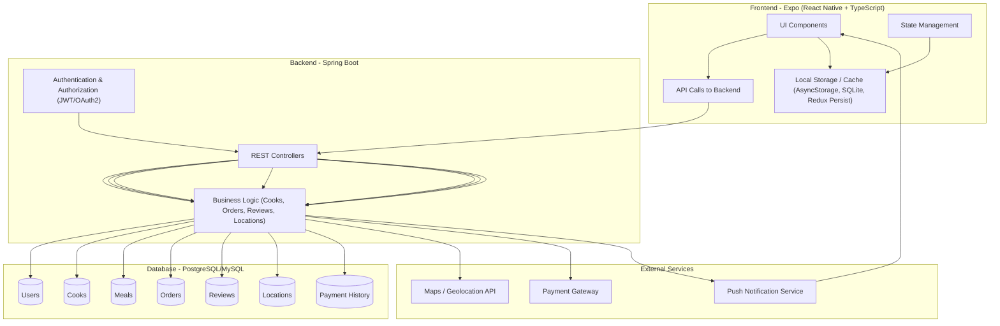

# Architecture Overview

This project follows a modular full-stack architecture with clear separation of concerns between the frontend, backend, and database.

## High-Level App Structure

### 1. Frontend (Expo + TypeScript)
- Built with Expo for cross-platform support (iOS & Android).
- Handles user interactions such as:
    - Browsing and searching for local cooks.
    - Viewing cook profiles, menus, and ratings.
    - Booking meals or services.
    - Managing user accounts and preferences.
- Uses EAS Build for production deployment.
- Integrates with push notifications to alert users of updates or booking reminders.

### 2. Backend (Spring Boot)
- REST API built with Spring Boot.
- Core features:
    - User authentication & authorization (JWT-based).
    - Cook and customer management.
    - Location-based search for nearby cooks.
    - Booking & order management.
    - Ratings and reviews system.
- Integrates with a relational database for persistence.
- Communicates with external services like maps APIs for geolocation and payment gateways for transactions.

### 3. Database
- Relational database (e.g., PostgreSQL or MySQL).
- Stores structured data:
    - Users (cooks and customers).
    - Menus & meal listings.
    - Orders & bookings.
    - Reviews & ratings.
    - Payment or transaction history (if integrated).

### 4. Authentication Layer
- Supports both form login and OAuth2 login (Google, Facebook).
- Issues JWT tokens to authenticate API requests.

### 5. External Services
- Maps / Geolocation API (Google Maps, OpenStreetMap) for locating nearby cooks.
- Payment Gateway (Stripe, PayPal) for secure transactions.
- Push Notifications (Expo Push, Firebase Cloud Messaging) to notify users about bookings, updates, or reminders.

### 6. DevOps / Tooling
- GitHub for version control, CI/CD, and issue tracking.
- Docker (optional) for consistent local environment setup.
- Unit & integration testing across backend and frontend.
- Monitoring/logging tools can be integrated (e.g., Sentry, Grafana) for better observability.

### 7. Data & Request Flow (Overview)
- User interacts with the mobile app (Expo).
- Frontend sends API requests to the backend (Spring Boot REST API).
- Backend validates requests, applies business logic, and queries the database.
- For location-based queries, the backend communicates with Maps API.
- ayments are processed via the Payment Gateway.
- Notifications are sent to users via the Push Notification Service.
- Backend returns responses to the frontend, which updates the UI.

## System Diagram

docs/architecture.md → this is where the High-Level App Structure (Expo frontend, Spring Boot backend, DB, etc.) with diagrams if possible.